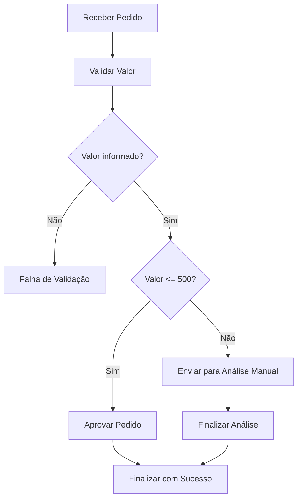
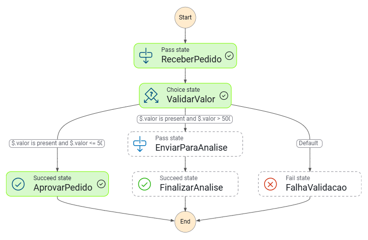
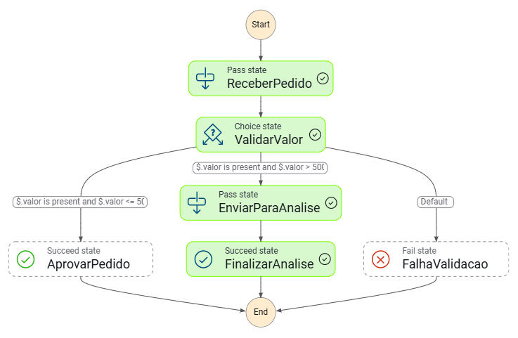
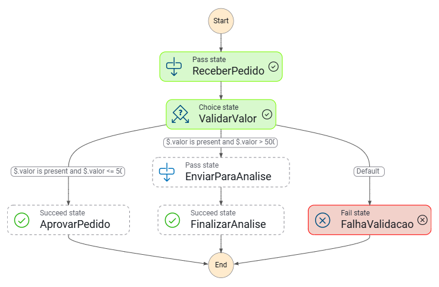

# AWS Step Functions - Workflow Automatizado

## Sobre o Projeto

Este projeto foi desenvolvido como parte do desafio do bootcamp da DIO em parceria com a GFT e AWS.

O objetivo do laboratório é consolidar os conhecimentos sobre **AWS Step Functions**, documentando a criação, execução e validação de um workflow automatizado baseado em uma regra de negócio simples.

Para isso, foi criado um fluxo de aprovação de pedidos utilizando uma **máquina de estados**, com etapas de recebimento, validação, decisão, aprovação, análise manual e tratamento de falha.

---

## Objetivos

* Compreender o funcionamento do AWS Step Functions.
* Criar e documentar uma máquina de estados.
* Aplicar lógica condicional utilizando o estado `Choice`.
* Executar diferentes cenários de teste com entradas JSON.
* Registrar evidências visuais da execução do workflow.
* Organizar o projeto no GitHub como documentação técnica.

---

## O que é AWS Step Functions?

O **AWS Step Functions** é um serviço serverless de orquestração que permite criar fluxos de trabalho automatizados.

Esses fluxos são chamados de **state machines** e são compostos por diferentes estados, responsáveis por representar etapas, decisões, sucessos, falhas e integrações com outros serviços da AWS.

No contexto deste laboratório, o Step Functions foi utilizado para representar um processo simples de aprovação de pedidos, permitindo visualizar o caminho percorrido por cada execução.

---

## Cenário Simulado

O cenário escolhido para este laboratório foi um **workflow de aprovação de pedidos**.

A regra de negócio utilizada foi:

* Pedidos com valor menor ou igual a `500` são aprovados automaticamente.
* Pedidos com valor maior que `500` são enviados para análise manual.
* Pedidos sem o campo `valor` são tratados como inválidos.

Esse cenário foi escolhido por permitir a prática de decisões condicionais dentro de um workflow, usando o estado `Choice`.

---

## Arquitetura do Workflow

Fluxo simplificado do processo:



---

## Estados Utilizados

| Estado              | Tipo      | Função                                                     |
| ------------------- | --------- | ---------------------------------------------------------- |
| `ReceberPedido`     | `Pass`    | Recebe os dados iniciais do pedido                         |
| `ValidarValor`      | `Choice`  | Avalia se o pedido possui valor e define o próximo caminho |
| `AprovarPedido`     | `Succeed` | Finaliza o workflow com aprovação automática               |
| `EnviarParaAnalise` | `Pass`    | Simula o envio do pedido para análise manual               |
| `FinalizarAnalise`  | `Succeed` | Finaliza o fluxo após a análise manual                     |
| `FalhaValidacao`    | `Fail`    | Finaliza o workflow com erro quando o pedido é inválido    |

---

## Estrutura do Repositório

```text
aws-step-functions-dio-gft/
│
├── docs/
│   ├── anotacoes.md
│   ├── aprendizados.md
│   ├── arquitetura.md
│   ├── cenarios-de-teste.md
│   └── roteiro-execucao.md
│
├── images/
│   ├── execucao-aprovada.png
│   ├── execucao-analise-manual.png
│   └── execucao-falha-validacao.png
│
├── inputs/
│   ├── pedido-aprovado.json
│   ├── pedido-analise-manual.json
│   └── pedido-invalido.json
│
├── workflows/
│   └── pedido-aprovacao.asl.json
│
├── .gitignore
├── LICENSE
└── README.md
```

---

## Definição da Máquina de Estados

A definição completa da máquina de estados está disponível no arquivo:

```text
workflows/pedido-aprovacao.asl.json
```

Abaixo está a estrutura utilizada no laboratório:

```json
{
  "Comment": "Workflow simples de aprovação de pedido usando AWS Step Functions",
  "StartAt": "ReceberPedido",
  "States": {
    "ReceberPedido": {
      "Type": "Pass",
      "Next": "ValidarValor"
    },
    "ValidarValor": {
      "Type": "Choice",
      "Choices": [
        {
          "And": [
            {
              "Variable": "$.valor",
              "IsPresent": true
            },
            {
              "Variable": "$.valor",
              "NumericLessThanEquals": 500
            }
          ],
          "Next": "AprovarPedido"
        },
        {
          "And": [
            {
              "Variable": "$.valor",
              "IsPresent": true
            },
            {
              "Variable": "$.valor",
              "NumericGreaterThan": 500
            }
          ],
          "Next": "EnviarParaAnalise"
        }
      ],
      "Default": "FalhaValidacao"
    },
    "AprovarPedido": {
      "Type": "Succeed"
    },
    "EnviarParaAnalise": {
      "Type": "Pass",
      "Next": "FinalizarAnalise"
    },
    "FinalizarAnalise": {
      "Type": "Succeed"
    },
    "FalhaValidacao": {
      "Type": "Fail",
      "Error": "ValorInvalido",
      "Cause": "O valor do pedido não foi informado ou não pôde ser validado."
    }
  }
}
```

---

## Cenários de Teste

A máquina de estados foi executada com três entradas diferentes para validar os caminhos possíveis do workflow.

| Cenário                            | Arquivo de entrada                  | Resultado esperado                                                        |
| ---------------------------------- | ----------------------------------- | ------------------------------------------------------------------------- |
| Pedido aprovado automaticamente    | `inputs/pedido-aprovado.json`       | Execução finalizada em `AprovarPedido`                                    |
| Pedido enviado para análise manual | `inputs/pedido-analise-manual.json` | Execução passou por `EnviarParaAnalise` e finalizou em `FinalizarAnalise` |
| Pedido inválido                    | `inputs/pedido-invalido.json`       | Execução finalizada em `FalhaValidacao`                                   |

---

## Exemplos de Entrada

### Pedido aprovado automaticamente

```json
{
  "pedidoId": "PED-001",
  "cliente": "Cliente Exemplo",
  "valor": 350
}
```

Resultado esperado:

```text
ReceberPedido -> ValidarValor -> AprovarPedido
```

---

### Pedido enviado para análise manual

```json
{
  "pedidoId": "PED-002",
  "cliente": "Cliente Corporativo",
  "valor": 1200
}
```

Resultado esperado:

```text
ReceberPedido -> ValidarValor -> EnviarParaAnalise -> FinalizarAnalise
```

---

### Pedido inválido

```json
{
  "pedidoId": "PED-003",
  "cliente": "Cliente Teste"
}
```

Resultado esperado:

```text
ReceberPedido -> ValidarValor -> FalhaValidacao
```

---

## Evidências do Laboratório

As execuções foram realizadas no AWS Step Functions, utilizando a máquina de estados criada para este laboratório.

### Execução com pedido aprovado automaticamente



### Execução com pedido enviado para análise manual



### Execução com falha de validação



As demais capturas de tela utilizadas durante a prática estão disponíveis na pasta:

```text
images/
```

---

## Como Executar o Laboratório

Para reproduzir este laboratório:

1. Acesse o Console da AWS.
2. Pesquise pelo serviço **Step Functions**.
3. Crie uma nova **State Machine**.
4. Escolha a opção de criação por código.
5. Copie a definição do arquivo `workflows/pedido-aprovacao.asl.json`.
6. Crie a máquina de estados.
7. Inicie execuções utilizando os arquivos da pasta `inputs`.
8. Valide o caminho percorrido por cada execução.
9. Registre as evidências visuais na pasta `images`.

---

## Aprendizados

Durante este laboratório, foi possível entender de forma prática como o AWS Step Functions facilita a criação de workflows automatizados e visuais.

A prática ajudou a compreender melhor:

* Como uma máquina de estados é estruturada.
* Como o input JSON percorre o workflow.
* Como utilizar o estado `Choice` para criar decisões condicionais.
* Como representar fluxos de sucesso e falha.
* Como documentar um processo técnico de forma clara no GitHub.

Além disso, o laboratório reforçou a importância da documentação técnica como parte do processo de aprendizado e da construção de portfólio.

---

## Possíveis Melhorias Futuras

Este projeto pode ser evoluído com novas integrações e melhorias, como:

* Integrar o workflow com uma função AWS Lambda.
* Enviar notificações com Amazon SNS.
* Registrar pedidos em uma tabela Amazon DynamoDB.
* Adicionar tratamento de erros mais detalhado.
* Criar logs e métricas de execução.
* Automatizar a infraestrutura com AWS SAM, Serverless Framework ou Terraform.

---

## Conclusão

Este desafio permitiu consolidar os principais conceitos sobre AWS Step Functions por meio de um laboratório simples, prático e documentado.

A criação do workflow de aprovação de pedidos demonstrou como processos de negócio podem ser representados por máquinas de estado, facilitando a visualização, rastreabilidade e organização das etapas.

O projeto também reforçou o uso do GitHub como ferramenta para documentação técnica, versionamento e compartilhamento de conhecimento.
