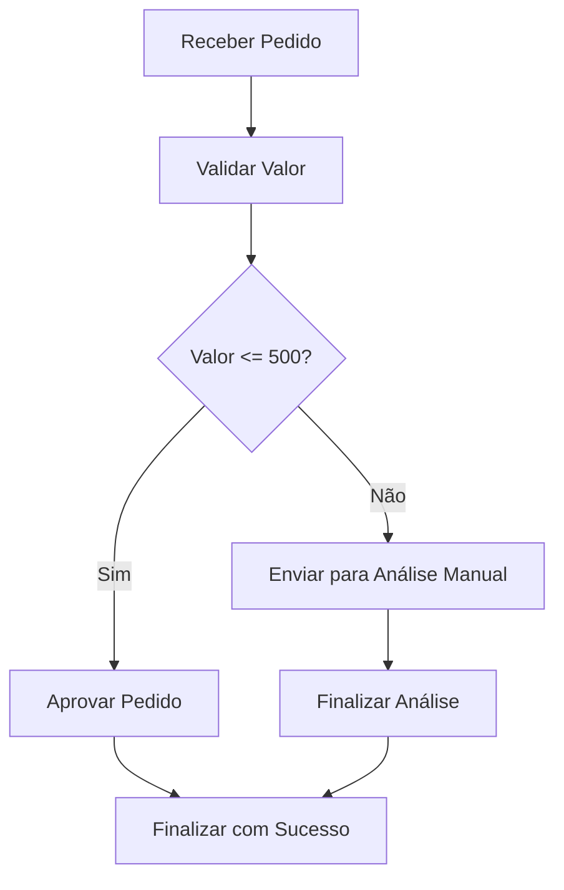

# Arquitetura do Workflow

Este projeto simula um fluxo de aprovação de pedidos utilizando AWS Step Functions.

A proposta é representar uma regra de negócio simples por meio de uma máquina de estados.

## Regra de negócio

- Pedidos com valor menor ou igual a 500 são aprovados automaticamente.
- Pedidos com valor maior que 500 seguem para análise manual.
- Pedidos sem valor informado devem ser tratados como entrada inválida.

## Fluxo do processo

## Estados utilizados

| Estado | Tipo | Função |
|---|---|---|
| ReceberPedido | Pass | Recebe os dados iniciais do pedido |
| ValidarValor | Choice | Avalia o valor do pedido |
| AprovarPedido | Succeed | Finaliza o fluxo com aprovação automática |
| EnviarParaAnalise | Pass | Encaminha o pedido para análise manual |
| FinalizarAnalise | Succeed | Finaliza o fluxo após análise |
| FalhaValidacao | Fail | Representa uma falha na validação |
